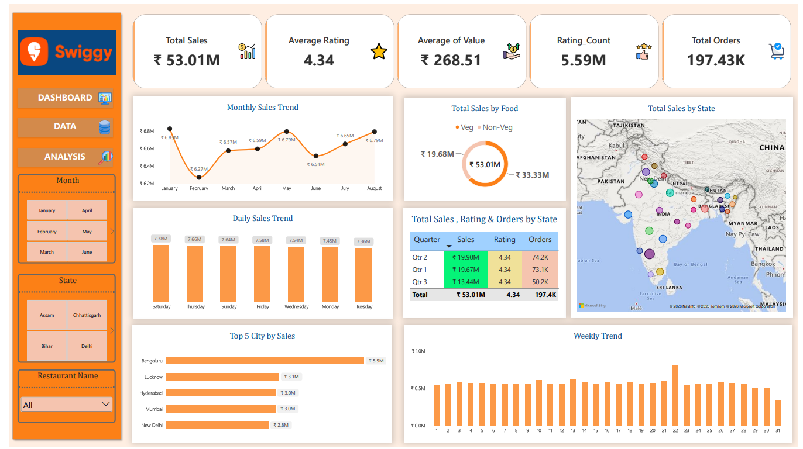

# Swiggy Sales Analysis Dashboard | Power BI

## 📊 Project Overview

An interactive Power BI dashboard created to analyze Swiggy sales performance, customer ratings, orders, food categories, cities, states, and sales trends.

## 🎯 Key KPIs

- Total Sales: ₹53.01M
- Total Orders: 197.43K
- Average Rating: 4.34
- Average Order Value: ₹268.51
- Rating Count: 5.59M

## 🔍 Key Insights

- Analyzed monthly, weekly, and daily sales trends
- Compared Veg vs Non-Veg sales
- Analyzed state-wise sales performance
- Identified Top 5 cities by sales
- Compared Sales, Ratings & Orders by Quarter
- Created interactive filters for Month, State, and Restaurant Name

## 🛠️ Tools & Technologies

- Power BI
- DAX
- Power Query
- Data Cleaning
- Data Transformation
- Data Visualization
- Exploratory Data Analysis

## 📈 Dashboard Preview

## 💡 Project Learning

This project helped me improve my skills in Power BI dashboard development, DAX calculations, KPI analysis, data visualization, and business-focused data storytelling.

## 👨‍💻 Author

Sanket Malvi

#PowerBI #DataAnalytics #DataAnalyst #DAX #PowerQuery #BusinessIntelligence #DataVisualization
